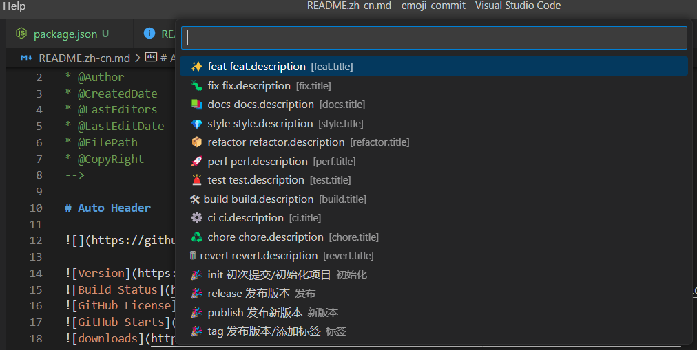
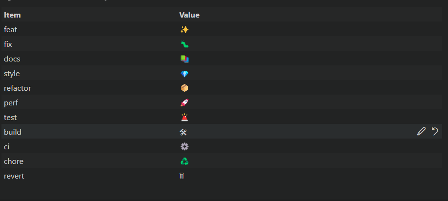

<!--
* @Author                : Robert Huang<56649783@qq.com>
* @CreatedDate           : 2023-02-04 20:34:47
* @LastEditors           : Robert Huang<56649783@qq.com>
* @LastEditDate          : 2023-02-04 20:35:05
* @FilePath              : emoji-commit/README.md
* @CopyRight             : MerBleueAviation
-->

# Emoji Commit Tiny

   
   

[English](./README.md) | [简体中文](./README.zh-cn.md)

Allowed you to customize the emoji icon, change it to your favorite icon.

**Enjoy!**
